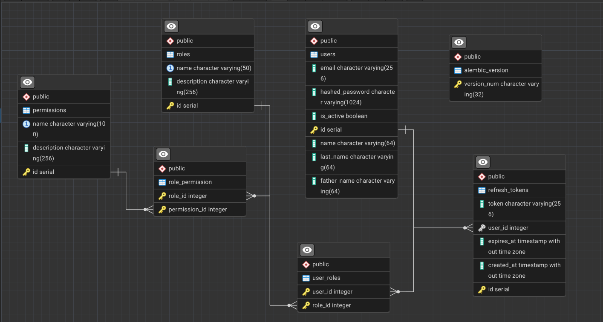

# AuthService

Система аутентификации и авторизации на базе FastAPI с поддержкой ролей и прав доступа (RBAC).

### Запуск (Локально)

1. Скопируйте проект

```bash
git clone https://github.com/yourusername/AuthService.git
cd AuthService
```

2. Создайте виртуальное окружение

```bash
python -m venv venv
source venv/bin/activate # Для Linux/macOS
venv\Scripts\activate # Для Windows
```

3. Установите зависимости

```bash
pip install -r requirements.txt
```

4. Создайте файл .env в корне проекта и заполните его по образцу:

```bash
DB_HOST=localhost
DB_PORT=5432
DB_USER=your_user
DB_PASS=your_password
DB_NAME=auth_service

SECRET_KEY=your_super_secret_key # Можно сгенерировать с помощью ssl
ALGORITHM=HS256
ACCESS_TOKEN_EXPIRE_MINUTES=30
REFRESH_TOKEN_EXPIRE_DAYS=7
```

### Работа с базой данных

1. Создание таблиц (Alembic)

```bash
alembic upgrade head
```

2. Заполнение тестовыми данными (Seeding)

```bash
python -m scripts.seed_db
```

Пользователи, которые будут представлены (почта/пароль)

```bash
Admin: roma@gmail.com / admin123

User: lena@gmail.com / user123

User: alex@gmail.com / alex123
```

### Запуск приложения

```bash
uvicorn app.main:app --reload
```

### Документация API

```bash
Swagger UI: http://127.0.0.1:8000/docs
```

### Структура базы данных


